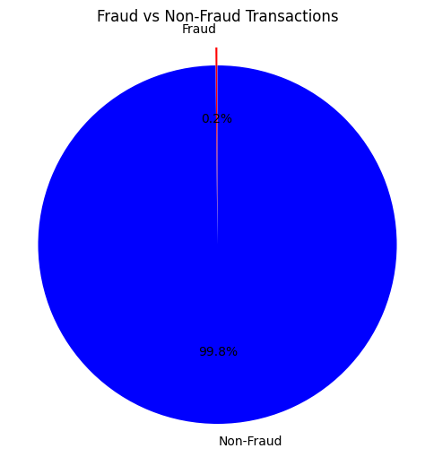
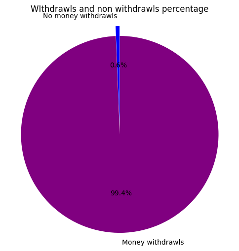
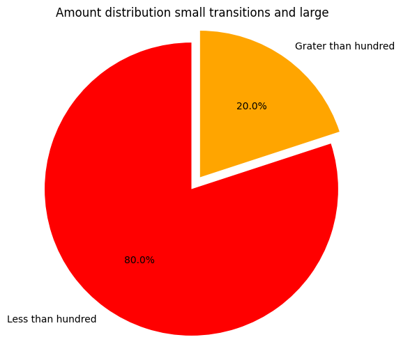
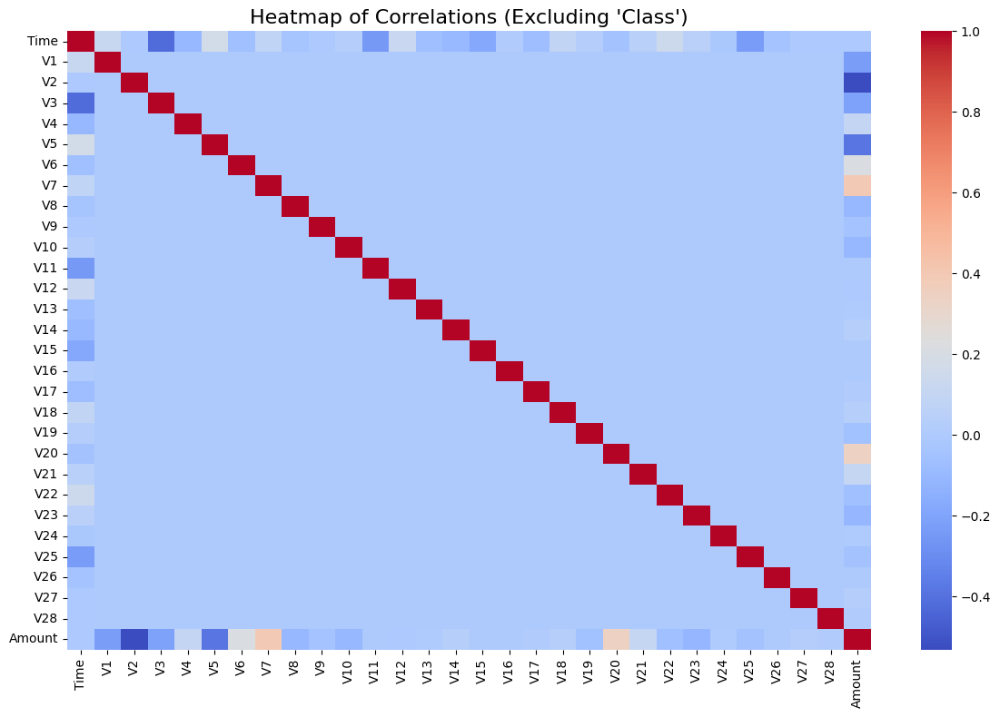
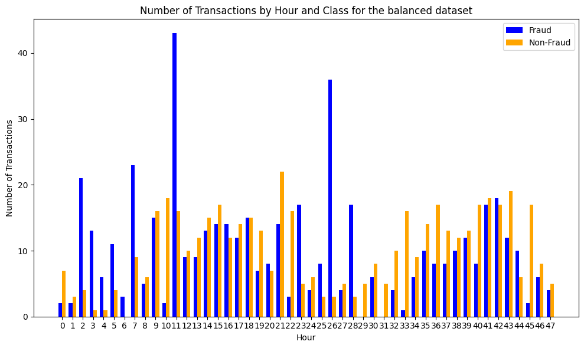

# CreditCard_Fraud_Detection
FraudGuard is a machine learning model for detecting fraudulent credit card transactions using anonymized transaction data.

## Dataset
The dataset used in this project contains anonymized transaction details with a target variable (`1` for fraud, `0` for non-fraud).


## Exploratory Data Analysis


### Key Insights:
- **Class Distribution**: The dataset is heavily imbalanced, with a majority of transactions being non-fraudulent.



- **Null Values**: Checked and handled during preprocessing.


### Key Insights from the Dataset

1. **Transaction Type Distribution**:
   - According to the dataset, **99.4% of transactions are withdrawals**, while the remaining **0.6%** represent other types of transactions.
   - This highlights that the majority of the activity in the dataset involves customers withdrawing money.
  

2. **Transaction Amount Distribution**:
   - A significant number of transactions have an amount **less than $100**.
   - This indicates that most customers are engaged in smaller transactions, which might impact the patterns for fraudulent vs. non-fraudulent behaviors.

  
#### Correlation Insights


  

##### 1. **V1 to V28 Features**

- **Observation:**  
  There is no significant correlation observed between features `V1` to `V28`. The exact behavior of these features remains unclear, and they don't seem to exhibit a strong relationship with each other.


##### 2. **Time Feature**

- **Weak Correlations:**  
  The `time` feature shows some weak negative correlation with specific features, such as:
  - **V3**: There is a noticeable negative correlation between `time` and `V3`.
  - **V11, V25, and V15**: These features show weak negative  correlations with `time` as well.

- **Other Features:**  
  Other features also display some level of correlation with `time`, though the correlation is not particularly strong.


##### 3. **Amount Feature**

- **Negative Correlation with V2:**  
  The `amount` feature shows a mostly negative correlation with `V2`.

- **Other Features:**  
  Apart from `V2`, the `amount` feature does not exhibit significant correlation with other features.

---

#### Conclusion

- The analysis indicates weak and inconsistent correlations between the `V1` to `V28` features, and only specific features like `V3` show some meaningful correlation with `time`.
- The `amount` feature exhibits a negative correlation with `V2` but not with other features.

This correlation analysis can guide further feature engineering or model interpretation steps to understand how these features contribute to the prediction task.

#### 4. **Transaction Analysis by Hour (Balanced vs. Unbalanced Dataset)**

1. **Unbalanced Dataset Chart:** Displays the number of transactions (fraud and non-fraud) for each elapsed time segment in the dataset.
2. **Balanced Dataset Chart:** Adjusts for the dataset's imbalance by sampling non-fraud transactions to match the number of fraud transactions.

##### Visualizations

###### 1. Unbalanced Dataset

The first chart visualizes transaction counts for fraud and non-fraud cases across different elapsed time segments. However, due to the overwhelming number of non-fraud transactions in the dataset, the patterns for fraud cases are less clear.

###### 2. Balanced Dataset

To address this, we created a second chart using a balanced dataset where the number of non-fraud transactions is sampled to equal the number of fraud transactions. This enables a clearer comparison between the two classes.

#### Insights

- **General Observation:**

  - Non-fraud transactions generally occur over a broader range of elapsed times compared to fraud transactions.
  - Certain time periods show significant spikes in fraud activity compared to non-fraud.

- **Dataset Bias:**

  - The original dataset is heavily biased toward non-fraud cases, making it difficult to analyze the behavior of fraud cases directly.

- **Balanced Dataset Observation:**

  - By balancing the dataset, we observe a clearer trend in how fraud and non-fraud transactions vary over elapsed time.
  - Patterns derived from this balanced dataset provide more actionable insights into fraud detection.

- **Time-Based Patterns:**

  - **Short Elapsed Time:** Transactions occurring within the first **2 to 9 hours** (based on elapsed time since the first transaction in the dataset) are more likely to be fraud cases. However, transactions occurring in **less than 2 hours** tend to be non-fraud.
  - **Long Elapsed Time:** Transactions occurring **beyond 9 hours** are predominantly non-fraud cases.
  - **Exceptions:** Time ranges between **21 and 28 hours** deviate from these general patterns, where the behavior of fraud and non-fraud cases varies significantly.
  - These conclusions are based on the balanced dataset and may not be observable directly visualizing  the chrt of  unbalanced dataset.

### Visualization Example
Below is the bar chart showing the **Number of Transactions by Hour and Class for the Balanced Dataset**:



### Conclusion

- Balancing the dataset is crucial for identifying meaningful patterns in skewed data distributions, such as fraud detection.
- Fraud transactions tend to occur within specific elapsed time ranges, such as **2 to 9 hours**, while non-fraud transactions are more distributed over longer elapsed times, typically exceeding **9 hours**.
- While general patterns are identifiable, exceptions like the time range **21 to 28 hours** highlight the complexity of fraud detection and the importance of contextual analysis.


## 1. Preprocessing
The preprocessing steps include:
- Checking for missing values


```python
# Import necessary libraries
import pandas as pd


# Check for null values
print(data.isnull().sum())
```


## 2.Feature Selection

For the feature selection in this project, I initially decided to use **all available features** for training the model. The reasons for this decision are:

1. **Initial Exploration with All Features**:
   - Since all the features in the dataset are numerical and represent different quantities, I used them all initially to train the model. This approach allows me to explore how the model performs with all features and observe the behavior and accuracy before refining the feature set.
   
2. **Feature Behavior in the Model**:
   - The goal at this stage was to allow the model to learn from all the data available, without prematurely excluding any feature. If the model shows any unexpected or poor performance, I can then refine the feature selection by removing less useful features. This iterative process helps to identify which features have the most impact on the predictions.

3. **Unique Features in the Dataset**:
   - It is important to note that the features used in this dataset may not be common in real-world domains. In real-world scenarios, we often don’t have access to or understand the exact behavior of such quantities. Therefore, I decided to keep all features initially to see how they affect the model and whether any features require further exploration or refinement.

In summary, I have started with all features in the dataset to observe their behavior in the model. Based on the results, I will decide if further feature selection is necessary. This approach ensures that no potentially useful features are prematurely excluded and allows for a comprehensive evaluation of the model's performance.


## 3.Choose a Suitable Model

For this credit card fraud detection task, I have chosen to use the **Random Forest Classifier**. There are several reasons for this choice:

1. **Handling a Large Number of Features**:
   - As the dataset contains around 30 features, Random Forest is a strong candidate because it performs well with a large number of features. Random Forest can handle both numerical and categorical features without requiring feature scaling or normalization.
   
2. **No Need for Data Scaling**:
   - Unlike other machine learning models such as Support Vector Machines (SVM) or K-Nearest Neighbors (KNN), Random Forest does not require the features to be scaled. This is particularly beneficial for our dataset, as scaling would otherwise add unnecessary complexity to the data preprocessing steps.
   
3. **Robust to Overfitting**:
   - Random Forest is less likely to overfit compared to individual decision trees due to the ensemble learning mechanism, where it creates multiple decision trees and combines their results. This helps in improving the model’s generalization on unseen data.

4. **Interpretability and Feature Importance**:
   - Random Forest provides insight into the importance of each feature in making predictions. This is valuable when trying to understand which features play a significant role in detecting fraudulent transactions.


## 4.Train and predict using the model 

### Using Random Forest Classifier


#### I. **Training with Entire Dataset (Unbalanced Data)**

- **Accuracy:** 99%
- **Observation:**  
  This high accuracy is misleading due to the dataset's imbalance. Since the dataset is skewed towards non-fraud transactions, the model predicts the majority class (non-fraud transactions) more accurately but fails to generalize for minority class instances (fraud cases).


#### II. **Training with Balanced Dataset, Predicting on Unbalanced Dataset**

- **Accuracy:** 97%
- **Observation:**  
  When the model is trained on a balanced dataset and tested on an unbalanced dataset, the accuracy decreases. However, this setup improves the model's ability to correctly identify fraud cases, which is the primary goal in fraud detection.


#### III. **Training with Balanced Dataset, Predicting on Balanced Dataset**

- **Accuracy:** 95%
- **Observation:**  
  The accuracy further decreases when both training and prediction are performed using balanced datasets. This is because the balanced dataset does not represent the real-world data distribution, making it less suitable for accurate predictions on real-world datasets.


#### Conclusion

- **Balanced Data for Training:**  
  Using a balanced dataset to train the model improves its ability to generalize and detect fraud cases effectively, even if it slightly reduces accuracy compared to training on unbalanced data.

- **Unbalanced Data for Prediction:**  
  Predicting on unbalanced data is more reflective of real-world performance. While the accuracy decreases slightly, the model is better at identifying minority class instances (fraud cases).


#### Recommendation

- **Training with a Balanced Dataset:**  
  Training with a balanced dataset is a good approach for improving the model's fairness and sensitivity to fraud cases.

- **Prediction with Unbalanced Dataset:**  
  When predicting, using the original unbalanced dataset is more appropriate to evaluate the model's performance in a real-world scenario.
